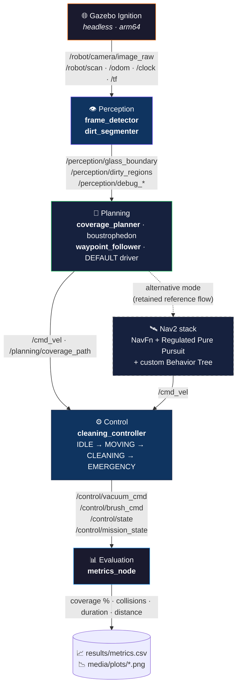

<div align="center">

# 🪟 Autonomous Window-Cleaning Robot

### ROS 2 Humble · Gazebo Fortress · Apple Silicon · Fully Containerised

*A camera-driven autonomous robot that sweeps a glass surface, detects dirty
regions in real time, and reaches full coverage without colliding with the
frame — running headless on an M-series Mac via Docker, visualised through
Foxglove.*

[](https://docs.ros.org/en/humble/)
[](https://gazebosim.org/docs/fortress)
[](https://www.docker.com/)
[](https://www.python.org/)
[](https://opencv.org/)
[](https://foxglove.dev/)
[](LICENSE)

**🌐 English** · [Türkçe](README.tr.md)

<!-- HERO IMAGE — replace with a Foxglove 3D screenshot of the robot mid-coverage. -->
<!-- Save to: media/screenshots/foxglove_hero.png  (path is already referenced). -->


</div>

---

## ✨ Highlights

- 🤖 **End-to-end autonomy** — perception → planning → control → evaluation,
  all as independent ROS 2 nodes with a strict topic contract between layers.
- 👁️ **OpenCV perception** — frame-edge detection + HSV dirt segmentation
  with debug image topics, verified in Foxglove before downstream use.
- 🧭 **Two driving modes, one contract** — a deterministic
  `waypoint_follower` (default, no Nav2) **and** a full Nav2 stack
  (NavFn + Regulated Pure Pursuit + custom Behavior Tree) retained as the
  documented alternative — both publish the same `/cmd_vel` +
  `/control/mission_state` interface.
- 🍎 **Apple Silicon, headless, containerised** — runs natively arm64 on a
  MacBook Air M4 with **zero X11 / XQuartz dependency** (GLX is broken on
  Apple Silicon). Gazebo runs headless; everything is streamed to **Foxglove
  Studio** over a WebSocket bridge.
- 📊 **Honest, reproducible benchmark** — 6 unattended runs across two worlds,
  CSV + auto-generated plots, partial-coverage results reported transparently
  rather than inflated.
- 📐 **Defensible modelling decision** — *vertical-surface kinematics
  modelled via 2-D planar abstraction* (`<gravity>0 0 0</gravity>`),
  documented and defended in the report rather than hidden.

---

## 🎬 Demo

<!-- GIF placeholder — drop a sped-up autonomous-coverage GIF here once captured. -->
<!-- Save to: media/gifs/coverage_run.gif  (path is already referenced).            -->
<!-- Recipe in docs/RESULTS.md §2 — screen-record with QuickTime, convert via      -->
<!-- ffmpeg -i input.mov -vf "fps=15,scale=720:-1" -loop 0 media/gifs/coverage_run.gif -->


> **Full 3-minute demo video:** `media/demo.mp4` (recording plan: [docs/RESULTS.md §2](docs/RESULTS.md#2-demo-video-plan)).

---

## 📐 Architecture



> **Driving controller (plan change 2026-05-16).** The default driver is the
> deterministic `waypoint_follower` (turn-then-drive on ground-truth `/odom`,
> straight to `/cmd_vel`, no Nav2). The gravity-free planar abstraction with
> ground-truth odometry made Nav2's reactive stack overkill and a source of
> path-following instability. The Nav2 flow (`path_follower` + `nav2.launch.py`
> + custom BT) is **kept as the documented advanced/alternative mode**. Both
> publish the same `/control/mission_state` + `/cmd_vel` contract, so
> perception, control and evaluation are unchanged. Rationale: roadmap
> Phase 3 AI Notes.

Full layer diagram, topic-contract table, algorithms (boustrophedon, OpenCV
pipelines, coverage metric) and the honest known-issues catalogue:
[docs/TECHNICAL.md](docs/TECHNICAL.md).

---

## 🚀 Quick Start

> All ROS 2 work runs **inside Docker**, not on the host Mac.

```bash
# 1) Build the dev image (~6 min on M4, arm64 native)
docker compose -f docker/docker-compose.yml build

# 2) Bring the sim up (headless Gazebo + Foxglove bridge on :8765)
docker compose -f docker/docker-compose.yml run --service-ports --rm \
  --name wc-sim ros2-dev \
  bash -c "source install/setup.bash && \
    ros2 launch window_cleaner_bringup sim.launch.py gui:=false foxglove:=true"
```

Then open **Foxglove Studio** on the Mac, connect to `ws://localhost:8765`
(*Foxglove WebSocket*), and load the saved panel layout from
[docs/RUNNING.md](docs/RUNNING.md).

> Visualisation is **Foxglove only** — XQuartz GLX is broken on Apple
> Silicon, so there is no X11 forwarding and no RViz. The full
> multi-terminal bring-up flow is documented in
> [docs/RUNNING.md](docs/RUNNING.md).

### Run the autonomous coverage (default mode)

```bash
# inside the running container
ros2 run window_cleaner_perception perception_pipeline
ros2 run window_cleaner_planning  coverage_planner   --ros-args -p use_sim_time:=true
ros2 run window_cleaner_planning  waypoint_follower  --ros-args -p use_sim_time:=true
ros2 run window_cleaner_control   cleaning_controller --ros-args -p use_sim_time:=true
```

### Reproduce the benchmark (Phase 4)

```bash
docker compose -f docker/docker-compose.yml run --service-ports --rm \
  --name wc-bench ros2-dev \
  bash -c "source install/setup.bash && \
    bash install/window_cleaner_evaluation/share/window_cleaner_evaluation/scripts/run_benchmark.sh --all --runs 3"
```

6 unattended runs (`glass_basic` + `glass_small` × 3) → `results/metrics.csv`
→ `media/plots/`.

---

## 📊 Results

> 6-run benchmark over the two working worlds (2026-05-16). **Coverage is
> intentionally partial** and `ABORTED`/`TIMEOUT` runs are recorded honestly
> rather than hidden — exactly the academic stance the roadmap prescribes.
>
> ⚠️ The committed benchmark was executed on the **Nav2 reference flow**,
> *before* the `waypoint_follower` plan change. Numbers describe the
> alternative mode, not the current default driver. Stated explicitly rather
> than silently re-numbered. Full analysis in
> [docs/RESULTS.md](docs/RESULTS.md).

| World        | Runs | Outcome    | Mean Coverage | Mean Duration | Collisions |
|--------------|:---:|------------|--------------:|--------------:|-----------:|
| `glass_basic` | 3 | 3× ABORTED | **18.74 %**   | 180.2 s       | **0**      |
| `glass_small` | 3 | 3× DONE    | **17.46 %**   |  17.7 s       | **0**      |
| **All 6**    | 6 | mixed      | **18.10 %**   |  99.0 s       | **0**      |

**Headline result:** *zero frame collisions across all 6 runs* — the safety
property the project was actually designed for.

<table>
<tr>
<td width="50%"></td>
<td width="50%"></td>
</tr>
<tr>
<td width="50%"></td>
<td width="50%"></td>
</tr>
</table>

Auxiliary diagnostic plots from the post-Phase-3 controller work (yaw
analysis, U-turn behaviour, gravity-fix drift) live alongside in
[media/plots/](media/plots/).

---

## 🧱 Tech Stack

| Layer          | Choice                                                    |
|----------------|-----------------------------------------------------------|
| Middleware     | ROS 2 Humble (Cyclone DDS)                                |
| Simulator      | Gazebo Fortress / Ignition (CLI: `ign gazebo`)            |
| Perception     | OpenCV 4.x + cv_bridge (Python)                           |
| Planning       | Custom boustrophedon coverage planner (Python)            |
| Driving        | Deterministic `waypoint_follower` (default) · Nav2 stack (alt) |
| Control        | Custom state machine (IDLE → MOVING → CLEANING → EMERGENCY) |
| Evaluation     | Passive `metrics_node` + matplotlib auto-plotter          |
| Containerisation | Docker + docker-compose (arm64 native, Apple Silicon)   |
| Visualisation  | **Foxglove Studio** over WebSocket (port 8765)            |
| Host platform  | macOS / MacBook Air M4 — **no X11, no RViz**              |

---

## 🗂️ Repository Layout

```
docker/                              Dockerfile, compose, entrypoint
src/
  window_cleaner_description/        URDF / xacro robot model
  window_cleaner_worlds/             SDF worlds (glass_basic / small / large / obstacles)
  window_cleaner_bringup/            launch files, Nav2 config, occupancy maps
  window_cleaner_perception/         camera, frame detector, dirt segmenter
  window_cleaner_planning/           boustrophedon planner + waypoint_follower (default)
                                     + path_follower (Nav2 alternative)
  window_cleaner_control/            vacuum / brush state machine
  window_cleaner_evaluation/         metrics_node, benchmark, plotting (Phase 4)
docs/
  RUNNING.md                         Full bring-up (Docker + Foxglove + multi-terminal)
  TECHNICAL.md                       Architecture, algorithms, known-issues catalogue
  RESULTS.md                         Benchmark results + demo-video shot list
results/
  metrics.csv                        Benchmark output
  benchmark_summary.txt              Run-by-run log
media/
  plots/                             Auto-generated benchmark + diagnostic plots
  screenshots/                       Foxglove / Gazebo / perception screenshots
  gifs/                              Sped-up coverage GIFs for the README
  demo.mp4                           Final 3-minute project video (user-owned)
PROJECT_ROADMAP.md                   Single source of truth (phase tracking)
```

---

## ⚠️ Known Limitations (Honest)

Documented openly — honest limitations earn academic credit; hidden ones lose
it. Full catalogue: [docs/TECHNICAL.md §3](docs/TECHNICAL.md#3-known-issues--limitations).

- **Obstacle-world navigation** — `glass_obstacles` reliably aborts under the
  Nav2 reference flow; excluded from the benchmark matrix.
- **U-turn overshoot** under low M4 real-time factor — the
  benchmark abort signature in `glass_basic`. Specific to the Nav2 alternative
  mode; the default `waypoint_follower` uses a deterministic two-stage turn.
- **Sub-1.0 Gazebo RTF on the M4** — durations reported are sim-clock
  seconds, not wall-clock.
- **Lidar height** is approximate; conservatively tuned to favour safety
  (zero collisions) over coverage.
- **2-D planar abstraction** of the glass — *intentional*, not a bug.
  Defended in [docs/TECHNICAL.md](docs/TECHNICAL.md).

---

## 📚 Documentation

| Doc | Purpose |
|---|---|
| [**docs/RUNNING.md**](docs/RUNNING.md) | Step-by-step bring-up: Docker, multi-terminal launch, Foxglove setup, saved panel layout |
| [**docs/TECHNICAL.md**](docs/TECHNICAL.md) | Architecture deep-dive, algorithms (boustrophedon, OpenCV pipeline, coverage metric), known-issues catalogue |
| [**docs/RESULTS.md**](docs/RESULTS.md) | Benchmark methodology, 6-run table, plot analysis, demo-video shot list |
| [**PROJECT_ROADMAP.md**](PROJECT_ROADMAP.md) | Single source of truth — phase-by-phase task tracking, AI notes (Turkish) |

---

## 📄 License

Released under the [MIT License](LICENSE).

---

<div align="center">

*Built as a university robotics project — ROS 2 + Gazebo + OpenCV on Apple
Silicon, with academic honesty about every limitation along the way.*

</div>
