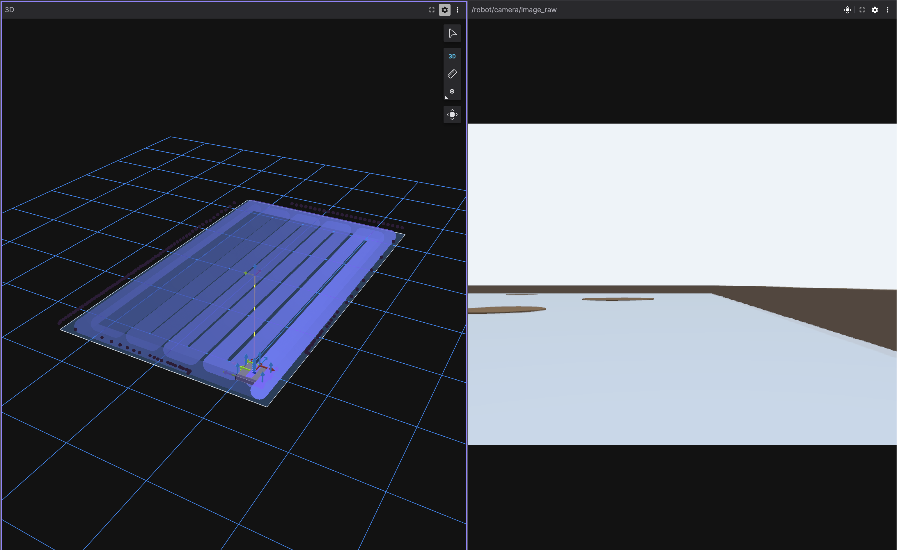
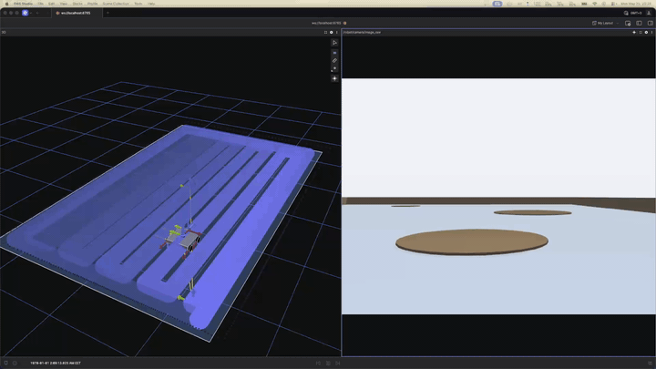
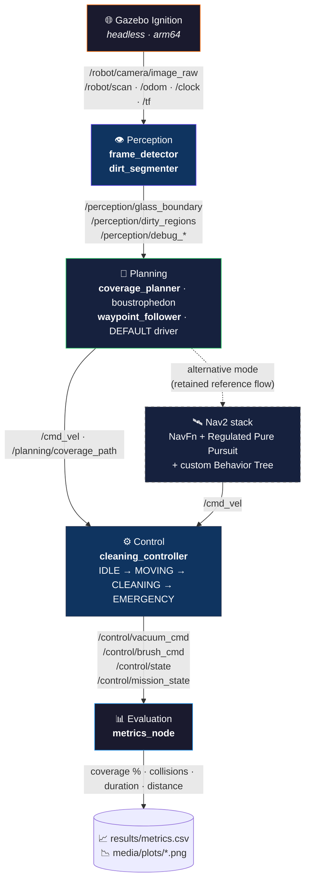

<div align="center">

# 🪟 Otonom Cam Temizleme Robotu

### ROS 2 Humble · Gazebo Fortress · Apple Silicon · Tamamen Konteynerize

*Bir cam yüzeyi tarayan, kirli bölgeleri gerçek zamanlı tespit eden ve
çerçeveye çarpmadan tam kaplama sağlayan, kameradan beslenen otonom bir
robot — M-serisi bir Mac üzerinde Docker ile başsız (headless) çalışır,
Foxglove üzerinden görselleştirilir.*

[](https://docs.ros.org/en/humble/)
[](https://gazebosim.org/docs/fortress)
[](https://www.docker.com/)
[](https://www.python.org/)
[](https://opencv.org/)
[](https://foxglove.dev/)
[](LICENSE)

[English](README.md) · **🌐 Türkçe**

<!-- HERO IMAGE — replace with a Foxglove 3D screenshot of the robot mid-coverage. -->
<!-- Save to: media/screenshots/foxglove_hero.png  (path is already referenced). -->



</div>

---

## ✨ Öne Çıkanlar

- 🤖 **Uçtan uca otonomi** — algılama → planlama → kontrol → değerlendirme,
  hepsi katmanlar arasında katı bir topic sözleşmesiyle bağımsız ROS 2
  düğümleri olarak.
- 👁️ **OpenCV algılama** — çerçeve-kenar tespiti + HSV kir segmentasyonu,
  hata ayıklama (debug) görüntü topic'leriyle, alt katmanlarda kullanılmadan
  önce Foxglove'da doğrulanmış.
- 🧭 **İki sürüş modu, tek sözleşme** — deterministik bir
  `waypoint_follower` (varsayılan, Nav2 yok) **ve** belgelenmiş alternatif
  olarak korunan tam bir Nav2 yığını (NavFn + Regulated Pure Pursuit +
  özel Behavior Tree) — ikisi de aynı `/cmd_vel` +
  `/control/mission_state` arayüzünü yayınlar.
- 🍎 **Apple Silicon, başsız, konteynerize** — bir MacBook Air M4 üzerinde
  **sıfır X11 / XQuartz bağımlılığıyla** doğal arm64 olarak çalışır (GLX
  Apple Silicon'da bozuk). Gazebo başsız çalışır; her şey bir WebSocket
  köprüsü üzerinden **Foxglove Studio**'ya akıtılır.
- 📊 **Dürüst, yeniden üretilebilir kıyaslama** — iki dünya genelinde 6
  gözetimsiz koşu, CSV + otomatik üretilen grafikler, kısmi-kaplama
  sonuçları şişirilmeden şeffaf biçimde raporlanmış.
- 📐 **Savunulabilir modelleme kararı** — *2-B düzlemsel soyutlama ile
  modellenmiş dikey-yüzey kinematiği* (`<gravity>0 0 0</gravity>`),
  gizlenmek yerine raporda belgelenmiş ve savunulmuş.

---

## 🎬 Demo

<!-- GIF placeholder — drop a sped-up autonomous-coverage GIF here once captured. -->
<!-- Save to: media/gifs/coverage_run.gif  (path is already referenced).            -->
<!-- Recipe in docs/RESULTS.md §2 — screen-record with QuickTime, convert via      -->
<!-- ffmpeg -i input.mov -vf "fps=15,scale=720:-1" -loop 0 media/gifs/coverage_run.gif -->



> **Tam 3 dakikalık demo videosu:** `media/demo.mp4` (kayıt planı: [docs/RESULTS.md §2](docs/RESULTS.md#2-demo-video-plan)).

---

## 📐 Mimari



> **Sürüş kontrolcüsü (plan değişikliği 2026-05-16).** Varsayılan sürücü,
> deterministik `waypoint_follower`'dır (ground-truth `/odom` üzerinde
> önce-dön-sonra-sür, doğrudan `/cmd_vel`'e, Nav2 yok). Ground-truth
> odometriye sahip yerçekimsiz düzlemsel soyutlama, Nav2'nin reaktif
> yığınını gereğinden fazla ve yol-takip kararsızlığının bir kaynağı haline
> getirdi. Nav2 akışı (`path_follower` + `nav2.launch.py` + özel BT)
> **belgelenmiş gelişmiş/alternatif mod olarak korunur**. İkisi de aynı
> `/control/mission_state` + `/cmd_vel` sözleşmesini yayınlar; bu nedenle
> algılama, kontrol ve değerlendirme değişmeden kalır. Gerekçe: yol
> haritası Faz 3 AI Notları.

Tam katman diyagramı, topic-sözleşme tablosu, algoritmalar (boustrophedon,
OpenCV ardışık düzenleri, kaplama metriği) ve dürüst bilinen-sorunlar
kataloğu: [docs/TECHNICAL.md](docs/TECHNICAL.md).

---

## 🚀 Hızlı Başlangıç

> Tüm ROS 2 çalışmaları, host Mac'te değil, **Docker içinde** çalışır.

```bash
# 1) Geliştirme imajını derle (M4'te ~6 dk, doğal arm64)
docker compose -f docker/docker-compose.yml build

# 2) Simülasyonu ayağa kaldır (başsız Gazebo + :8765 üzerinde Foxglove köprüsü)
docker compose -f docker/docker-compose.yml run --service-ports --rm \
  --name wc-sim ros2-dev \
  bash -c "source install/setup.bash && \
    ros2 launch window_cleaner_bringup sim.launch.py gui:=false foxglove:=true"
```

Ardından Mac'te **Foxglove Studio**'yu açın, `ws://localhost:8765`'e
bağlanın (*Foxglove WebSocket*) ve kayıtlı panel düzenini
[docs/RUNNING.md](docs/RUNNING.md) dosyasından yükleyin.

> Görselleştirme **yalnızca Foxglove** üzerindendir — XQuartz GLX Apple
> Silicon'da bozuk olduğundan X11 yönlendirme ve RViz yoktur. Tam
> çok-terminalli ayağa kaldırma akışı [docs/RUNNING.md](docs/RUNNING.md)
> içinde belgelenmiştir.

### Otonom kaplamayı çalıştır (varsayılan mod)

```bash
# çalışan konteynerin içinde
ros2 run window_cleaner_perception perception_pipeline
ros2 run window_cleaner_planning  coverage_planner   --ros-args -p use_sim_time:=true
ros2 run window_cleaner_planning  waypoint_follower  --ros-args -p use_sim_time:=true
ros2 run window_cleaner_control   cleaning_controller --ros-args -p use_sim_time:=true
```

### Kıyaslamayı yeniden üret (Faz 4)

```bash
docker compose -f docker/docker-compose.yml run --service-ports --rm \
  --name wc-bench ros2-dev \
  bash -c "source install/setup.bash && \
    bash install/window_cleaner_evaluation/share/window_cleaner_evaluation/scripts/run_benchmark.sh --all --runs 3"
```

6 gözetimsiz koşu (`glass_basic` + `glass_small` × 3) → `results/metrics.csv`
→ `media/plots/`.

---

## 📊 Sonuçlar

> İki çalışan dünya üzerinde 6-koşuluk kıyaslama (2026-05-16). **Kaplama
> kasıtlı olarak kısmidir** ve `ABORTED`/`TIMEOUT` koşuları gizlenmek yerine
> dürüstçe kaydedilmiştir — tam olarak yol haritasının öngördüğü akademik
> duruş.
>
> ⚠️ Kaydedilen kıyaslama, `waypoint_follower` plan değişikliğinden *önce*,
> **Nav2 referans akışıyla** yürütüldü. Rakamlar mevcut varsayılan
> sürücüyü değil, alternatif modu tanımlar. Sessizce yeniden
> numaralandırmak yerine açıkça belirtilmiştir. Tam analiz:
> [docs/RESULTS.md](docs/RESULTS.md).

| Dünya         | Koşu | Sonuç      | Ort. Kaplama  | Ort. Süre     | Çarpışma   |
|--------------|:---:|------------|--------------:|--------------:|-----------:|
| `glass_basic` | 3 | 3× ABORTED | **%18.74**    | 180.2 s       | **0**      |
| `glass_small` | 3 | 3× DONE    | **%17.46**    |  17.7 s       | **0**      |
| **Toplam 6** | 6 | karışık    | **%18.10**    |  99.0 s       | **0**      |

**Başlıca sonuç:** *6 koşunun tamamında sıfır çerçeve çarpışması* — projenin
gerçekte tasarlandığı güvenlik özelliği.

<table>
<tr>
<td width="50%"></td>
<td width="50%"></td>
</tr>
<tr>
<td width="50%"></td>
<td width="50%"></td>
</tr>
</table>

Faz-3 sonrası kontrolcü çalışmasından gelen yardımcı tanılama grafikleri (yaw
analizi, U-dönüşü davranışı, yerçekimi-düzeltme kayması) yanında
[media/plots/](media/plots/) içinde yer alır.

---

## 🧱 Teknoloji Yığını

| Katman         | Seçim                                                     |
|----------------|-----------------------------------------------------------|
| Ara katman     | ROS 2 Humble (Cyclone DDS)                                |
| Simülatör      | Gazebo Fortress / Ignition (CLI: `ign gazebo`)            |
| Algılama       | OpenCV 4.x + cv_bridge (Python)                           |
| Planlama       | Özel boustrophedon kaplama planlayıcısı (Python)          |
| Sürüş          | Deterministik `waypoint_follower` (varsayılan) · Nav2 yığını (alt.) |
| Kontrol        | Özel durum makinesi (IDLE → MOVING → CLEANING → EMERGENCY) |
| Değerlendirme  | Pasif `metrics_node` + matplotlib otomatik grafikleyici   |
| Konteynerizasyon | Docker + docker-compose (doğal arm64, Apple Silicon)    |
| Görselleştirme | **Foxglove Studio**, WebSocket üzerinden (port 8765)      |
| Host platformu | macOS / MacBook Air M4 — **X11 yok, RViz yok**            |

---

## 🗂️ Depo Yapısı

```
docker/                              Dockerfile, compose, entrypoint
src/
  window_cleaner_description/        URDF / xacro robot modeli
  window_cleaner_worlds/             SDF dünyaları (glass_basic / small / large / obstacles)
  window_cleaner_bringup/            launch dosyaları, Nav2 yapılandırması, occupancy haritaları
  window_cleaner_perception/         kamera, çerçeve dedektörü, kir segmentleyici
  window_cleaner_planning/           boustrophedon planlayıcı + waypoint_follower (varsayılan)
                                     + path_follower (Nav2 alternatifi)
  window_cleaner_control/            vakum / fırça durum makinesi
  window_cleaner_evaluation/         metrics_node, kıyaslama, grafikleme (Faz 4)
docs/
  RUNNING.md                         Tam ayağa kaldırma (Docker + Foxglove + çok-terminal)
  TECHNICAL.md                       Mimari, algoritmalar, bilinen-sorunlar kataloğu
  RESULTS.md                         Kıyaslama sonuçları + demo-video çekim listesi
results/
  metrics.csv                        Kıyaslama çıktısı
  benchmark_summary.txt              Koşu-koşu günlüğü
media/
  plots/                             Otomatik üretilen kıyaslama + tanılama grafikleri
  screenshots/                       Foxglove / Gazebo / algılama ekran görüntüleri
  gifs/                              README için hızlandırılmış kaplama GIF'leri
  demo.mp4                           Nihai 3 dakikalık proje videosu (kullanıcıya ait)
PROJECT_ROADMAP.md                   Tek doğruluk kaynağı (faz takibi)
```

---

## ⚠️ Bilinen Kısıtlamalar (Dürüst)

Açıkça belgelenmiştir — dürüst kısıtlamalar akademik kredi kazandırır,
gizlenenler kaybettirir. Tam katalog:
[docs/TECHNICAL.md §3](docs/TECHNICAL.md#3-known-issues--limitations).

- **Engelli-dünya navigasyonu** — `glass_obstacles`, Nav2 referans akışı
  altında güvenilir biçimde iptal olur (abort); kıyaslama matrisinden
  hariç tutulmuştur.
- **U-dönüşü aşımı** düşük M4 gerçek-zaman faktörü altında —
  `glass_basic`'teki kıyaslama iptal imzası. Nav2 alternatif moduna özgüdür;
  varsayılan `waypoint_follower`, deterministik iki-aşamalı dönüş kullanır.
- **M4'te 1.0 altı Gazebo RTF** — raporlanan süreler duvar-saati değil,
  simülasyon-saati saniyeleridir.
- **Lidar yüksekliği** yaklaşıktır; güvenliği (sıfır çarpışma) kaplamaya
  tercih edecek şekilde temkinli ayarlanmıştır.
- **Camın 2-B düzlemsel soyutlaması** — *kasıtlıdır*, bir hata değil.
  [docs/TECHNICAL.md](docs/TECHNICAL.md) içinde savunulmuştur.

---

## 📚 Belgeler

| Belge | Amaç |
|---|---|
| [**docs/RUNNING.md**](docs/RUNNING.md) | Adım adım ayağa kaldırma: Docker, çok-terminalli başlatma, Foxglove kurulumu, kayıtlı panel düzeni |
| [**docs/TECHNICAL.md**](docs/TECHNICAL.md) | Mimari derinlemesine inceleme, algoritmalar (boustrophedon, OpenCV ardışık düzeni, kaplama metriği), bilinen-sorunlar kataloğu |
| [**docs/RESULTS.md**](docs/RESULTS.md) | Kıyaslama metodolojisi, 6-koşuluk tablo, grafik analizi, demo-video çekim listesi |
| [**PROJECT_ROADMAP.md**](PROJECT_ROADMAP.md) | Tek doğruluk kaynağı — faz-faz görev takibi, AI notları (Türkçe) |

---

## 📄 Lisans

[MIT Lisansı](LICENSE) altında yayınlanmıştır.

---

<div align="center">

*Bir üniversite robotik projesi olarak inşa edildi — Apple Silicon üzerinde
ROS 2 + Gazebo + OpenCV, yol boyunca her kısıtlama hakkında akademik
dürüstlükle.*

</div>
