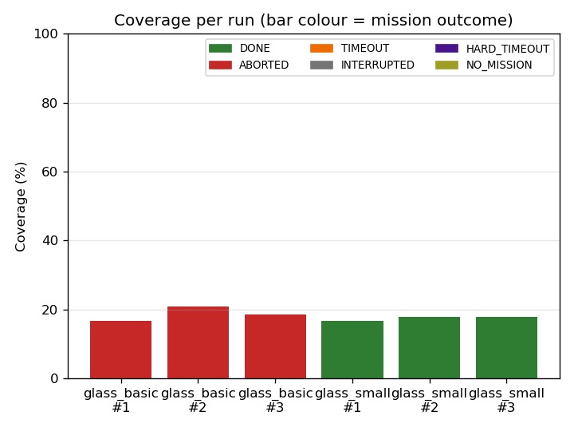
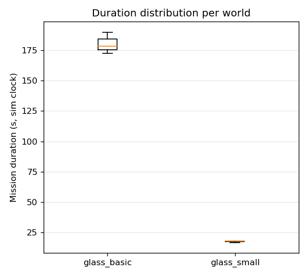
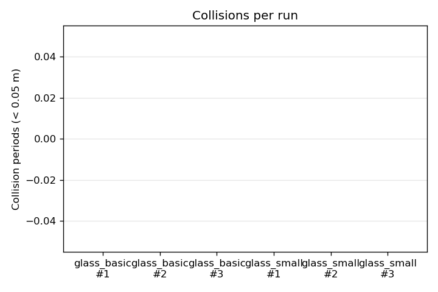
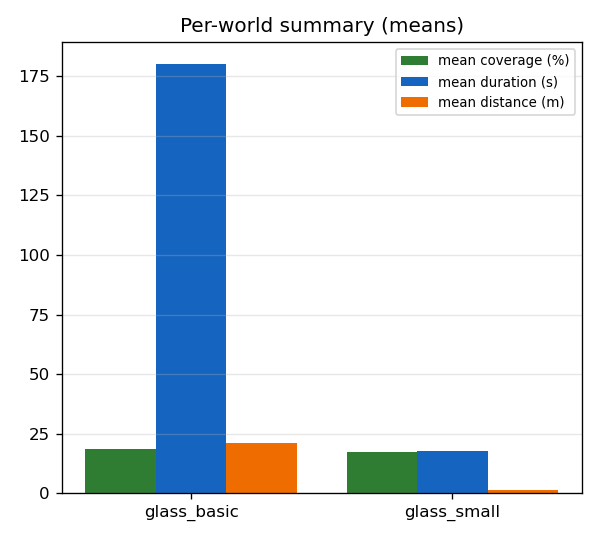

# Results & Evaluation

Benchmark results from the Phase-4 sweep, plus the manual demo-video shot
list (recording is user-owned — the AI cannot produce a binary video).

---

## 1. Benchmark Results

> **Status: final for the Nav2 reference flow.** 6-run benchmark executed
> 2026-05-16 on the user's MacBook Air M4 (Docker / headless Ignition).
> Tables, plots and analysis below are filled from `results/metrics.csv`
> (committed) and `media/plots/*.png` (committed).
>
> ⚠️ **Honest note — this benchmark predates the driving-controller plan
> change.** It was run on the **Nav2 reference flow** (`path_follower` +
> NavFn + Regulated Pure Pursuit). The post-Phase-3 plan change to the
> deterministic `waypoint_follower` (commit `c180ffe`, 2026-05-17) is
> *later* than this run, so every number, the `ABORTED` outcomes, and the
> "Nav2 recovery thrash" abort analysis below describe the **alternative**
> mode — **not** the current default driver, which has not been
> re-benchmarked. This is stated explicitly rather than silently
> re-numbering data. To benchmark the new default, re-run
> `run_benchmark.sh` with the `waypoint_follower` flow and regenerate this
> file; see roadmap Phase 3 AI Notes for the plan change.

### 1.1 Methodology

* **Matrix:** `glass_basic` + `glass_small`, 3 runs each = **6 runs** (plan
  change 2026-05-16, agreed with the user — see roadmap task 4.5).
  `glass_obstacles` is excluded because it reliably ABORTs (documented
  Phase-3 limitation, [TECHNICAL.md §3.2](TECHNICAL.md#3-known-issues--limitations));
  `glass_large` is excluded because it is geometrically identical to
  `glass_basic` (only dirt count differs) and would not vary the
  navigation result.
* **Platform:** MacBook Air M4, ROS 2 Humble + Ignition Fortress, headless,
  inside Docker. Gazebo RTF < 1.0, so **all durations are sim-clock
  seconds**, not wall-clock.
* **Per run:** `metrics_node` (passive) records one CSV row. Mission ends
  on `DONE`/`ABORTED` from `/control/mission_state`, on its 420 s sim
  watchdog (`TIMEOUT`), or on the 480 s wall-clock outer backstop in
  `run_benchmark.sh` (`HARD_TIMEOUT`).
* **Coverage** is measured over the *real* glass surface (basic
  ±2.50/±1.50, small ±1.00/±0.50) with a 0.05 m grid and a 0.12 m
  vacuum-pad footprint disc — not the coverage_planner inset, so an
  uncleaned wall-adjacent strip lowers the number honestly.
* **Collisions** = distinct periods with `min(/robot/scan) < 0.05 m`
  (1.0 s clear-hysteresis).

Reproduce:

```bash
docker compose -f docker/docker-compose.yml run --service-ports --rm \
  --name wc-bench ros2-dev \
  bash -c "source install/setup.bash && \
    bash install/window_cleaner_evaluation/share/window_cleaner_evaluation/scripts/run_benchmark.sh --all --runs 3"
```

### 1.2 6-run table

From `results/metrics.csv` (2 worlds × 3 runs, 2026-05-16).

| World | Run | Result | Coverage % | Collisions | Duration (s) | Distance (m) |
|---|---|---|---:|---:|---:|---:|
| glass_basic | 1 | ABORTED | 16.73 | 0 | 172.4 | 20.345 |
| glass_basic | 2 | ABORTED | 20.95 | 0 | 189.8 | 22.178 |
| glass_basic | 3 | ABORTED | 18.55 | 0 | 178.5 | 20.939 |
| glass_small | 1 | DONE | 16.75 | 0 | 16.8 | 1.539 |
| glass_small | 2 | DONE | 17.75 | 0 | 18.2 | 1.648 |
| glass_small | 3 | DONE | 17.88 | 0 | 18.1 | 1.660 |
| **basic mean** | | 3× ABORTED | **18.74** | **0** | **180.2** | **21.154** |
| **small mean** | | 3× DONE | **17.46** | **0** | **17.7** | **1.616** |

Aggregate: 6 runs, mean coverage **18.10 %**, **0 collisions total**,
mean mission duration **99.0 s** (sim clock).

### 1.3 Plots

Auto-generated by `plot_results.py` into `media/plots/` at the end of the
sweep:

* `coverage_by_run.png` — coverage % per run, bar colour = outcome.
* `duration_box.png` — duration distribution per world.
* `collisions_bar.png` — collision periods per run (all zero).
* `summary_grouped.png` — per-world means (coverage / duration / distance).






### 1.4 Analysis

* **Hardest world: `glass_basic` — confirmed.** All 3 runs end `ABORTED`.
  The 9-strip boustrophedon path has eight 180° U-turns; the documented
  Phase-3 U-turn overshoot (low M4 RTF + ~6 Hz lidar feeding a controller
  that would run at 10 Hz on real hardware) eventually trips Nav2 recovery
  thrash and the mission aborts after ~180 s sim with ~17–21 % of the
  surface swept. `glass_small` falls into the narrow-span centreline
  fallback (~2 strips); the short mission **completes (`DONE`) in all 3
  runs** in ~17–18 s. Outcome is the cleanest separator between the two
  worlds: 3× ABORTED vs 3× DONE.

* **Coverage is intentionally partial — including the `DONE` runs.**
  `glass_small` reaches `DONE` yet still reports only ~17 % coverage.
  `DONE` means the *planned* path finished, not that the whole pane was
  physically swept: coverage is scored over the **real** surface with the
  0.12 m vacuum-pad disc, not the planner inset. Two honest effects lower
  it — (a) the planner insets by `strip_width/2`, leaving an uncleaned
  wall-adjacent band; (b) `strip_width` (0.30 m) exceeds the footprint
  diameter (0.24 m), so even a fully executed sweep leaves ~0.06 m gaps
  between strips. The number is therefore not inflated by a shrunken
  denominator — exactly the roadmap's stance.

* **Zero collisions across all 6 runs — the headline result.** The robot
  never makes near-contact with the frame in any run (basic *or* small),
  consistent with Phase 3 ("no frame collisions"). The tight 0.05 m
  threshold plus the 1.0 s clear-hysteresis ensure this is a real result,
  not lidar-speckle being filtered away.

* **Repeatability.** `glass_small` is highly deterministic (coverage
  16.75–17.88 %, duration 16.8–18.2 s — a ~1 s spread). `glass_basic`
  varies more (coverage 16.73–20.95 %) because the abort point depends on
  which U-turn the overshoot accumulates at, itself sensitive to the
  variable M4 real-time factor. Distance tracks duration: ~21 m over ~180 s
  on basic, ~1.6 m over ~18 s on small.

* **Takeaway.** *No frame collisions + honest, reproducible partial
  coverage* with every limitation measured and attributed (U-turn
  overshoot, low RTF, honest coverage denominator) rather than hidden — the
  academic result the roadmap explicitly says earns credit. Full limitation
  catalogue: [TECHNICAL.md §3](TECHNICAL.md#3-known-issues--limitations).

---

## 2. Demo Video Plan

Roadmap tasks 4.7–4.9 (screen recording + editing) are **manual, user-owned**
— a binary video cannot be produced by the AI. This shot list maps the
roadmap's ~3-minute structure to concrete commands and the exact Foxglove
panels to show. Record on the Mac, edit in iMovie/DaVinci, drop the final
clip at `media/demo.mp4` and note its path in roadmap AI-Notes Phase 4.

### 2.1 Capture setup

* **Tool:** QuickTime Player → File → New Screen Recording (simplest on
  macOS; OBS only if you want a webcam/overlay).
* **Layout:** full-screen Foxglove Studio with the saved panel layout from
  [RUNNING.md](RUNNING.md) §4 (Panels: 3D, Image, Teleop, Raw Messages).
  Optionally a small terminal tile top-right showing the launch commands.
* **Speed-up:** record the autonomous run at 1× and speed the coverage
  segment ~8× in editing (a full run is several minutes on M4).
* Royalty-free music + section titles in editing.

### 2.2 Pre-roll (before recording)

```bash
# Terminal 1 — sim (basic world), headless + Foxglove
docker compose -f docker/docker-compose.yml run --service-ports --rm \
  --name wc-sim ros2-dev \
  bash -c "source install/setup.bash && \
    ros2 launch window_cleaner_bringup sim.launch.py gui:=false foxglove:=true"
# wait for: foxglove_bridge ... listening on 8765
```
Connect Foxglove (`ws://localhost:8765`, **Foxglove WebSocket**), load the
saved layout. In the default (no-Nav2) mode `sim.launch.py` publishes the
static `map→odom` TF, so the 3D Fixed frame can stay `map`.

### 2.3 Segments (~3:00 total)

| Time | Content | Commands / panels |
|---|---|---|
| 0:00–0:15 | **Title.** Project name, "ROS 2 + Gazebo, 2-D planar abstraction of a window cleaner", student name. | Title card (editing). |
| 0:15–0:45 | **Spawn + manual drive.** Robot on the blue glass with brown dirt discs; drive a few metres with the Teleop pad. | Foxglove 3D panel + Teleop panel. `ros2 run teleop_twist_keyboard ...` optional. |
| 0:45–1:30 | **Perception.** Camera feed; frame boundary (blue) on `/perception/debug_frame`; dirt contours (green) + centres (red) on `/perception/debug_dirt`. | Start `perception.launch.py` (Terminal 3, `docker compose exec wc-sim ...`). Foxglove Image panel cycling the debug topics. |
| 1:30–2:30 | **Autonomous coverage (≈8× sped up).** Default driver = `coverage_planner` + `waypoint_follower` (no Nav2); show the boustrophedon `/planning/coverage_path` in 3D, the robot snaking with clean two-stage U-turns, `/control/state` flipping MOVING↔CLEANING, mission_state WAITING→RUNNING→DONE. Be honest: coverage is intentionally partial (planner inset + strip gap). | Terminals per RUNNING.md "Running coverage — default mode" (coverage_planner, waypoint_follower) + control. 3D panel: `/planning/coverage_path` + `/planning/glass_boundary_viz` + TF; Raw Messages: `/control/mission_state`. (Nav2 reference flow is the alternative — see RUNNING.md.) |
| 2:30–3:00 | **Metrics + conclusion.** Show `results/metrics.csv` and the four `media/plots/*.png`; one line on the honest partial-coverage / 2-D-abstraction framing. | `cat results/metrics.csv`; the plot PNGs. Closing card → [TECHNICAL.md §3](TECHNICAL.md#3-known-issues--limitations) takeaway. |

### 2.4 Optional: record straight from the benchmark

For a hands-off coverage segment you can screen-record while
`run_benchmark.sh --world glass_basic --runs 1` executes, then trim. The
rosbag (`--bag`) of run 1 can also be replayed for a clean re-record:

```bash
ros2 bag play media/bags/glass_basic_run1
```

### 2.5 Deliverable checklist

- [ ] `media/demo.mp4` recorded (~3 min, sped-up coverage segment)
- [ ] Section titles + the explicit **Limitations** mention (2-D
      abstraction, partial coverage — earns academic credit)
- [ ] Path + duration recorded in roadmap **AI Notes — Phase 4**
